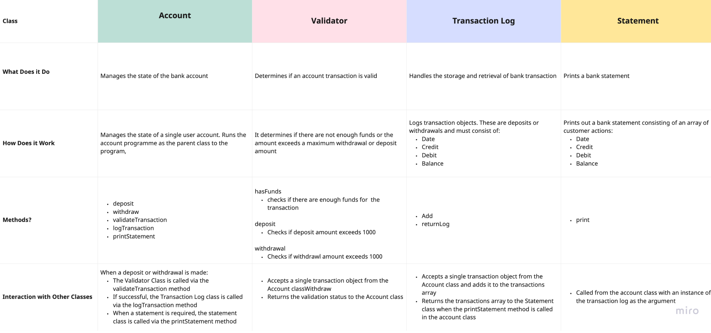

# Bank Tech Test

## Specification:

### Requirements

* You should be able to interact with your code via a REPL like IRB or Node.  (You don't need to implement a command line interface that takes input from STDIN.)
* Deposits, withdrawal.
* Account statement (date, amount, balance) printing.
* Data can be kept in memory (it doesn't need to be stored to a database or anything).

### Acceptance criteria
```md
**Given** a client makes a deposit of 1000 on 10-01-2023  
**And** a deposit of 2000 on 13-01-2023  
**And** a withdrawal of 500 on 14-01-2023  
**When** she prints her bank statement  
**Then** she would see
```
date || credit || debit || balance
14/01/2023 || || 500.00 || 2500.00
13/01/2023 || 2000.00 || || 3000.00
10/01/2023 || 1000.00 || || 1000.00
```
```

## My approach 

### Designing and planning

Using the acceptance criterea and product specification I began planning the architecture of my program, starting with a top-down overview of the classes and methods that I wanted and how they would interact. 

I then created application and UML diagrams to help me visualise how it may look:




This allowed me to make any adjustments before outlining the class system in a [design file.](Design/programDesign.md)

 Describe how you structured your code. Why did you do it this way?

## How to Run the program

 Describe how to install and run your code and tests.

 Describe the dependencies your code has. What trade-offs did you make when deciding what dependencies to use?

## Extending the program

 Describe the extensions you would add if you had more time.

 Spelling and grammar.