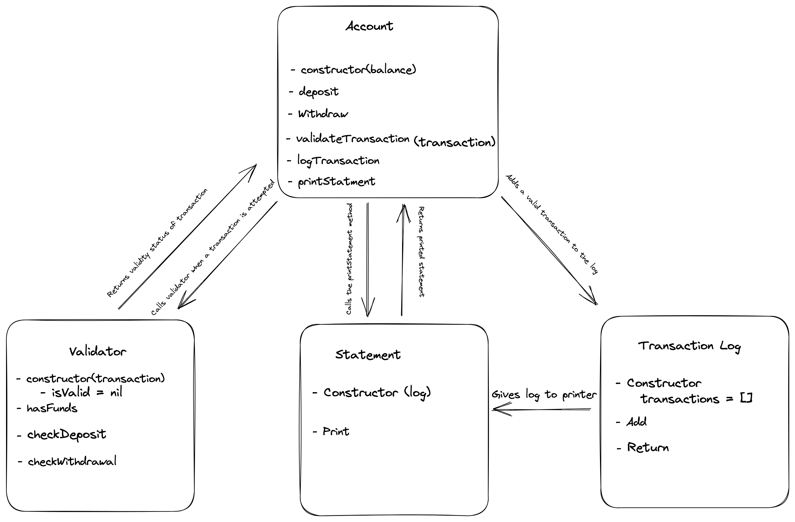

# Bank Tech Test

## Specification:

### Requirements

* You should be able to interact with your code via a REPL like IRB or Node.  (You don't need to implement a command line interface that takes input from STDIN.)
* Deposits, withdrawal.
* Account statement (date, amount, balance) printing.
* Data can be kept in memory (it doesn't need to be stored to a database or anything).

### Acceptance criteria
```md
**Given** a client makes a deposit of 1000 on 10-01-2023  
**And** a deposit of 2000 on 13-01-2023  
**And** a withdrawal of 500 on 14-01-2023  
**When** she prints her bank statement  
**Then** she would see:

date || credit || debit || balance
14/01/2023 || || 500.00 || 2500.00
13/01/2023 || 2000.00 || || 3000.00
10/01/2023 || 1000.00 || || 1000.00
```

## My approach 

### Designing and planning

Using the acceptance criterea and product specification I began planning the architecture of my program, starting with a top-down overview of the classes and methods that I wanted and how they would interact. 

I then created application and UML diagrams to help me visualise how it may look:




This allowed me to make any adjustments before outlining the class system in a [design file.](Design/programDesign.md)

 ### Code Structure

 I wanted my program to closely follow the single responsiblity principle, with classses and methods that are decoupled, flexible and scalable. This meant splitting my app into 4 classes:

 > 1. Account - this would manage how a user interacts with the bank account
 > 2. Validator - this would validate any transactions a user makes
 > 3. LogTransaction - this would log a users transaction history
 > 4. PrintStatement - this would handle formatting and printing bank statements 

 ### Program example:
 
 In the below example, a user is running the program in Node. When they program is initialised, the balance is set to 0 and a new instance of the `LogTransaction` class is created to track the user's transactions. 
 
```Javascript
 const Account = require('./Account');
 const myAccount = new Account();
 
 const depositTransaction = {
  date: "2022-01-23",
  debit: 500,
  credit: 0
}

const withdrawTransaction = {
  date: "2022-01-24",
  debit: 0,
  credit: 250
}

myAccount.deposit(depositTransaction);
myAccount.withdraw(withdrawTransaction);

console.log(myAccount.printStatement());
```
 They make a single deposit and a single withdraw. When each of these transactions is called, the `add` method is called and the transaction is formatted and stored in the log.

 When the user calls the `printStatement` method, a new instance of the `printStatement` class is created, and the following statment is printed to the console:

 ```Javascript
date || credit || debit || balance
2022-01-24 ||  || 250.00 || 250.00
2022-01-23 ||  ||  || 500.00
 ```
## How to use

>1. Clone this repository
>2. Install dependencies with `npm install`
>3. Run tests with `npx jest`

### Tests

The programme contains two kinds of tests:
* Unit tests for each class, divided into test blocks for each method
* An integration test 

## Extending the program

If I was extending the programme, I would add the following functionality:

- Currency handling: present statements in a currency format (could be GBP or a setting a user could input)
- Add user interactivity:
  - Allow user to create and access account
  - encrpyt and store account information
  - connect to an account database
- Add a user interface 
  
